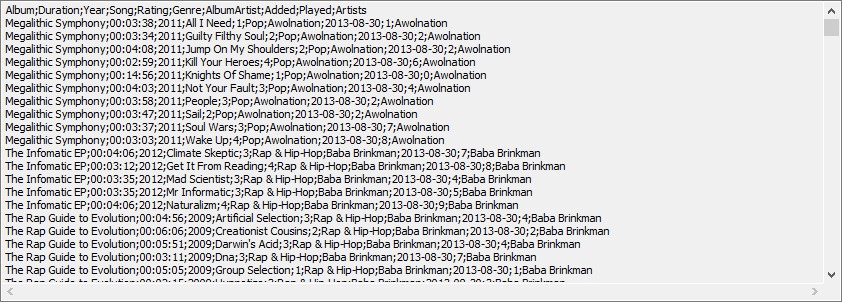
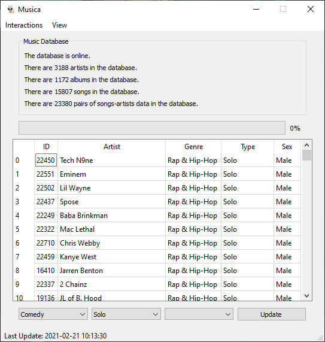
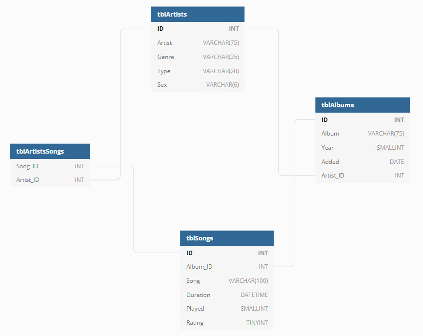

# Introduction
Created to aid me manage my music library, this application extracts information out of Foobar2000 and delivers a data warehouse that can be plugged into Microsoft Power BI to better visualize and give context to your music collection.

It effectively turns this:

Into this:

Along with other smaller and complementary tasks...

# Environment

## Foobar2000
Foobar2000 is a freeware audio player for Microsoft Windows, iOS and Android developed by Peter Pawłowski. [Learn More](https://en.wikipedia.org/wiki/Foobar2000)

The particular theme that I use on it can be downloaded [here](https://mega.nz/file/v8J0gDbb#4Jx7nswXYDTpdwn2AqmrKEgmYfzAPtQtzuj2236GWA4). Other UI designs can be used, but they may prevent some features from working properly. On that note, you will also need to make sure all your music is appropriately tagged.

As far as 3rd party complements that need to be installed, you'll have to [download Text Tools](https://www.foobar2000.org/components/view/foo_texttools). This complement allows us to generate a CSV list of our library that contains all the data we need.

## Python
Made in a 64-bit Python 3.7.6 environment. See Requirements.txt for full module list.

## MSSQL Server
Database engine used by the program.

## Windows
Operating system used for development. Auto-scraping (see Features) will not work out of the box if you use a different OS.

## Power BI
Dashboarding tool used to display the resulting visualizations to the user.

# Features

## GUI
The program can be operated on its entirety from the GUI, meaning that it has access to all the application's features. It also allows the user to further tag their music, incorporating information that foobar2000 does not collect through its tags (e.g. an artist's gender).

## Scraper
The app has 2 methods it can use to import your raw data. The manual way of doing it is by copying the information provided by Text Tools into a .txt or .csv file and then importing that to the application. The auto scraper, on the other hand, utilizes pyautogui and pyperclip to get that information on its own. Be careful as it may need further configuration to work for you. Test it first.

## ETL Process
Once data has been supplied to the program, it takes that csv and applies some SQL magic to go from a single file to a series of related and manageable SQL tables. This process is incremental and very fast.

The database design is as follows:

## Video Player
An experimental and not really essential feature that identifies the song that is being played and opens Microsoft Edge to the YouTube video of said song. The video and audio seldomly sync properly, it is meant to provide some visuals while you play music.

## Dashboard
PBIX File that provides some built-in visualizations for your data.

## Execute command
Provides you with a way of passing SQL statements to the database.

## Duplicate finder
Meant to find typos in artists' names to avoid duplicates. For example, it will match Ashnikko with Ashniko so you can go and fix your tags or mark it as not duplicate (which will be remembered the next time you run that analysis).

## Custom views
By default, the app shows you a table where each row represents an artist. You can use this feature to query the database in any way you want. If you like a particular view, you can also give it a name and save its definition so you can reuse it in the future.
